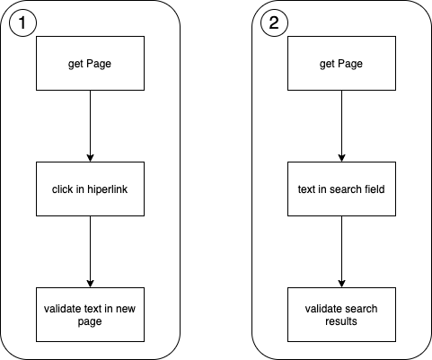

# Test Selenium

This program implements two tests to show the capabilities of Selenium. Below you can see the tests workflow:

## Execution

You can execute from maven command. So you need java 8 and maven must be configured. You can test whit the next 
commands from terminal:

    echo $JAVA_HOME
    mvn -version

>You can configure Java with below steps [click here](https://adoptium.net/installation.html)

>You can configure Maven with below steps [click here](https://maven.apache.org/install.html)

To execute test you run the below command

    mvn clean test

But If you want to run a specific test, run de bellow command

    mvc -Dtest=TEST_CLASS:TEST_NAME clean test

Where TEST_NAME could be IntoToSeleniumDocumentationFromSeleniumHomePage or FillFormAndValidate. 

    Eg.
    mvc -Dtest=SeleniumTest#IntoToSeleniumDocumentationFromSeleniumHomePage clean test